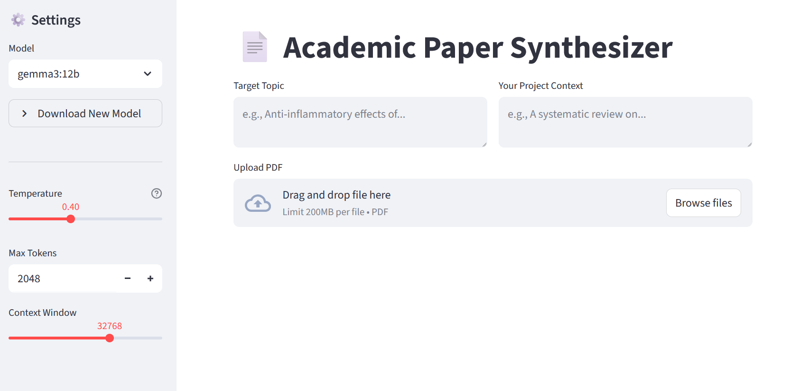

# 📄 Academic Paper Synthesizer



A local AI tool built with **Streamlit**, **LangChain**, and **Ollama** to extract, summarize, and rewrite academic papers using models like **Gemma 3 12B**.

## Prerequisites

**You must have Ollama installed and running on your system.**

1.  **Install Ollama:** [ollama.com](https://ollama.com)
2.  **Start the Service:**
    ```bash
    ollama serve
    ```
3.  **Pull a Model** (Recommended):
    ```bash
    ollama pull gemma3:12b
    ```

## Installation

1.  **Clone the repository:**
    ```bash
    git clone https://github.com/luiz-bcardoso/streamlit-ollama.git
    cd streamlit-ollama
    ```

2.  **Create and activate a virtual environment:**
    ```bash
    python3 -m venv venv
    source venv/bin/activate
    ```

3.  **Install dependencies:**
    ```bash
    pip install -r requirements.txt
    ```

## Usage

1.  **Run the application:**
    ```bash
    streamlit run rag_paper_summarizer.py
    ```

2.  **Access the interface:**
    * **Local:** Open your browser to `http://localhost:8501`.
    * **Remote (SSH):** Use port forwarding: `ssh -L 8501:localhost:8501 user@server-ip`.

## Requirements (`requirements.txt`)

```text
streamlit
ollama
langchain-ollama
docling
